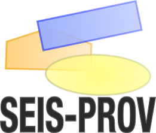

SEIS-PROV: Provenance for Seismological Data
============================================

Welcome to the ``SEIS-PROV`` documentation and definition. This document is organized as follows:

The first part introduces the concept of provenance and why it matters for our science.

.. toctree::
    :maxdepth: 2
    :glob:

    motivation

Following is a section with an introduction to ``W3C PROV`` and a high level
overview of the design of ``SEIS-PROV``.

.. toctree::
    :maxdepth: 2
    :glob:

    seis_prov

The actual definitions are then detailed in this section.

.. toctree::
    :maxdepth: 2
    :glob:

    _generated_details

The technical definition is provided by a JSON file which acts as a kind of
schema.

.. toctree::
    :maxdepth: 2
    :glob:

    schema

``SEIS-PROV`` documents must be validated and verified to be correct to be of
any use. This section details this process and which steps must be performed.

.. toctree::
    :maxdepth: 2
    :glob:

    validation

The final section illustrates some more complex use cases and scenarios.

.. toctree::
    :maxdepth: 2
    :glob:

    usage_examples
